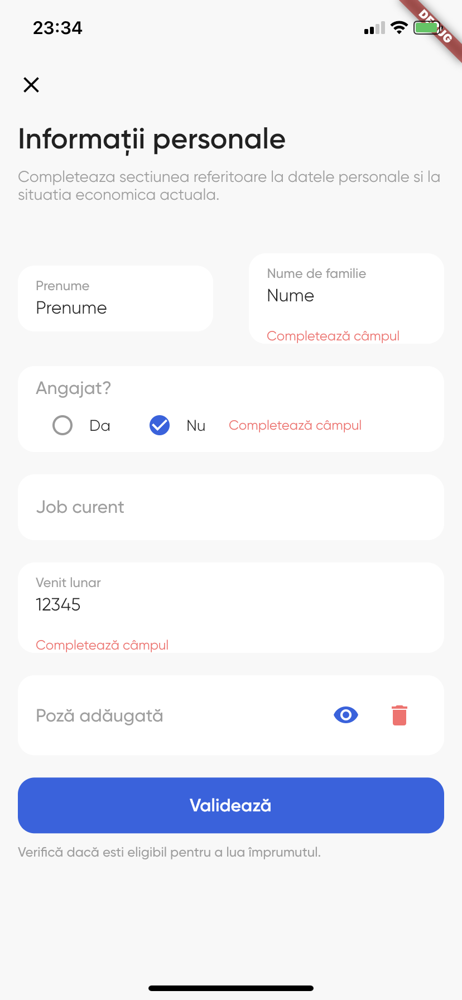
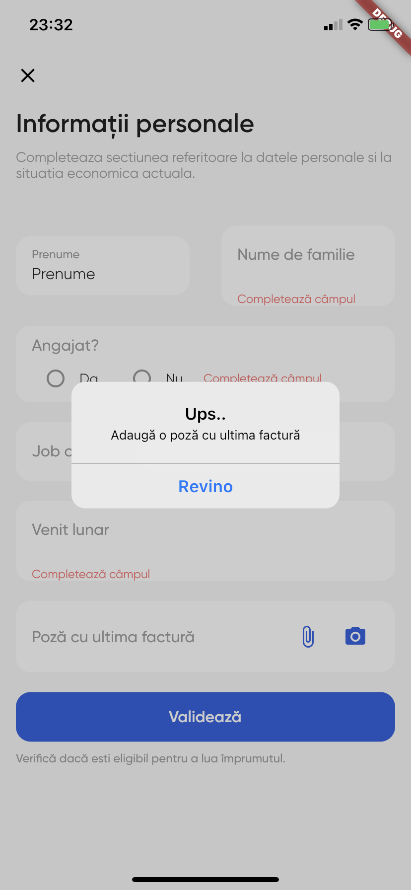

# MyCreditLoans 

 Technical coding challenge project for [Evonomix](https://www.evonomix.com/) 

## Getting Started

This project requires `Flutter` to be installed
```
https://flutter.dev/docs/get-started/install
```

## How to use

**Step 1 :**
Download or close this repo by using the link below:
```
https://github.com/antoniocranga/mycreditloans.git
```
**Step 2 :**
Go to `project root` and execute the following command in console to get the required dependencies:
```
flutter pub get
```
**Step 3 :**
`Run` the project:
```
flutter run
```

## Screenshots
<p float="left">






</p>
